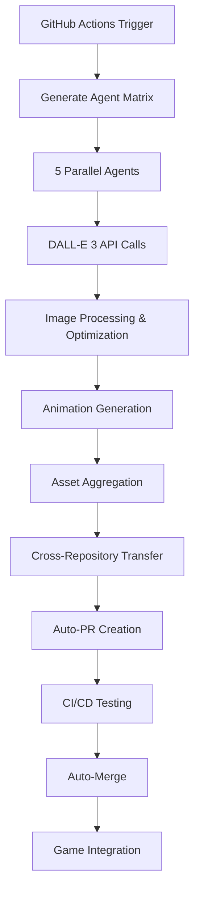

# 🐛 Bug Buddies - AI-Powered Desktop Insect Game

Bug Buddies is a desktop idle game featuring AI-generated pixel art insects with a fully automated parallel agent asset generation system.

## 🎨 AI Asset Generation System

This project features a revolutionary **5-agent parallel asset generation system** that automatically creates pixel art insects and animations using OpenAI's DALL-E 3 API, then recursively integrates them into the game repository.

### 🤖 Agent Assignments

- **Agent 1**: 🪲 Beetle (brown, walking animation)
- **Agent 2**: 🦋 Butterfly (colorful, flying animation)  
- **Agent 3**: 🐞 Ladybug (red/black, walking animation)
- **Agent 4**: 🐛 Caterpillar (green, crawling animation)
- **Agent 5**: 🎮 UI Elements (food, effects, icons)

## 🚀 Quick Start

### Prerequisites

- Node.js 16+ and npm/pnpm
- Python 3.11+
- OpenAI API key
- GitHub tokens for cross-repository access

### Installation

1. **Clone the repository**
   ```bash
   git clone https://github.com/magatona/bug-buddies.git
   cd bug-buddies
   ```

2. **Install dependencies**
   ```bash
   npm install
   pip install openai pillow imageio requests
   ```

3. **Configure GitHub Secrets**
   
   Set up the following secrets in your GitHub repository:
   
   ```yaml
   OPENAI_API_KEY: your_openai_api_key
   GITHUB_TOKEN: your_github_token
   GAME_REPO_TOKEN: your_game_repo_write_token  # Optional, defaults to GITHUB_TOKEN
   DISCORD_WEBHOOK_URL: your_discord_webhook    # Optional
   SLACK_WEBHOOK_URL: your_slack_webhook        # Optional
   ```

4. **Run the game**
   ```bash
   npm start
   ```

## 🎯 Asset Generation Workflow

### Manual Trigger

Generate assets on-demand via GitHub Actions:

1. Go to **Actions** → **Bug Buddies Parallel Asset Generation**
2. Click **Run workflow**
3. Select options:
   - **Asset Type**: `all`, `characters`, `animations`, or `ui`
   - **Quality Level**: `draft`, `standard`, or `high`
4. Click **Run workflow**

### Automated Schedule

Assets are automatically generated daily at 2:00 AM UTC.

### 🔄 Recursive Integration Process

1. **Parallel Generation**: 5 agents generate assets simultaneously
2. **Quality Check**: Automatic optimization and validation
3. **Animation Creation**: GIF generation for walking/flying/crawling
4. **Cross-Repository Transfer**: Automatic file transfer to game repo
5. **Auto-PR Creation**: Detailed pull request with asset preview
6. **CI Integration**: Automated testing and validation
7. **Auto-Merge**: Automatic merge after successful CI checks
8. **Notification**: Discord/Slack notifications on completion

## 📁 Project Structure

```
bug-buddies/
├── .github/workflows/
│   ├── asset-generation.yml      # Main parallel generation workflow
│   └── recursive-integration.yml # Auto-merge and monitoring
├── scripts/
│   ├── generate_asset_matrix.py  # Agent assignment matrix
│   ├── generate_assets.py        # DALL-E 3 integration
│   ├── create_animations.py      # GIF animation creation
│   ├── aggregate_assets.py       # Asset collection and optimization
│   ├── transfer_to_game_repo.py  # Cross-repository integration
│   ├── find_asset_pr.py         # PR discovery
│   ├── monitor_and_merge.py     # Auto-merge monitoring
│   └── send_notification.py     # Webhook notifications
├── src/assets/
│   └── AssetManager.js           # Dynamic asset loading system
├── assets/                       # Generated assets (auto-created)
│   ├── characters/
│   │   ├── beetle/
│   │   ├── butterfly/
│   │   ├── ladybug/
│   │   └── caterpillar/
│   ├── animations/
│   │   ├── beetle/
│   │   ├── butterfly/
│   │   ├── ladybug/
│   │   └── caterpillar/
│   ├── ui/
│   └── manifest.json            # Asset registry
├── game.js                      # Main game logic with asset integration
├── index.html                   # Game interface
└── main.js                      # Electron main process
```

## 🎮 Game Features

### Core Gameplay
- **Desktop Pet Experience**: Transparent window overlay
- **Interactive Feeding**: Click to drop food pellets
- **Insect AI**: Autonomous movement and feeding behavior
- **Leveling System**: Insects grow and evolve over time
- **Multi-Insect Ecosystem**: Support for multiple insect types

### Asset Integration
- **Dynamic Loading**: AssetManager automatically loads AI-generated sprites
- **Fallback System**: Seamless fallback to programmatic drawing if assets fail
- **Animation Support**: Smooth GIF animation playback
- **Performance Optimized**: Preloading and caching for smooth gameplay

## 🔧 Technical Architecture

### Asset Generation Pipeline



### AssetManager Integration

The `AssetManager.js` provides:
- **Manifest-based Loading**: Dynamic asset discovery
- **Lazy Loading**: Assets loaded on-demand
- **Error Handling**: Graceful fallback to programmatic drawing
- **Caching**: Efficient memory management
- **Multi-format Support**: PNG sprites and GIF animations

### Game Integration

```javascript
// Automatic asset loading in Insect class
if (window.assetManager && this.currentAsset) {
    this.drawAssetSprite(ctx);  // Use AI-generated sprite
} else {
    this.drawInsect(ctx);       // Fallback to programmatic drawing
}
```

## 🛠️ Development

### Local Testing

Test asset generation locally:

```bash
# Test single agent
export AGENT_ID=1
export INSECT_TYPE=beetle
export ASSET_VARIANTS='["idle", "walk_1", "walk_2"]'
python scripts/generate_assets.py

# Test animation creation
export ANIMATION_TYPES='["walking", "idle"]'
python scripts/create_animations.py

# Test asset aggregation
python scripts/aggregate_assets.py
```

### Debugging

Enable debug logging:

```bash
export DEBUG=1
export VERBOSE=1
npm start
```

### Custom Prompts

Modify `scripts/generate_assets.py` to customize DALL-E 3 prompts:

```python
def get_prompt_templates(self):
    return {
        "beetle": {
            "base": "32x32 pixel art of a cute brown beetle...",
            "variants": {
                "idle": "standing still, facing right",
                "walk_1": "left leg forward, walking pose"
            }
        }
    }
```

## 📊 Monitoring & Analytics

### Asset Generation Metrics
- Success/failure rates per agent
- Generation time statistics
- API usage tracking
- Quality assessment scores

### Game Performance
- Asset loading times
- Memory usage optimization
- Animation frame rates
- User interaction metrics

## 🔒 Security

### API Key Management
- All secrets stored in GitHub Secrets
- Minimal privilege tokens
- Automatic token rotation support
- Rate limiting and usage monitoring

### Cross-Repository Access
- Separate read/write tokens
- Repository-specific permissions
- Audit logging for all transfers
- Automatic cleanup of old branches

## 🚨 Troubleshooting

### Common Issues

**Asset Generation Fails**
```bash
# Check API key
echo $OPENAI_API_KEY

# Verify agent configuration
python scripts/generate_asset_matrix.py
```

**Cross-Repository Transfer Issues**
```bash
# Check token permissions
gh auth status

# Verify repository access
gh repo view magatona/bug-buddies
```

**Game Asset Loading Problems**
```javascript
// Check AssetManager status
console.log(window.assetManager.getStats());

// Verify manifest
fetch('assets/manifest.json').then(r => r.json()).then(console.log);
```

### Error Recovery

The system includes comprehensive error recovery:
- **Automatic Retries**: Failed generations retry up to 3 times
- **Fallback Assets**: Placeholder generation for missing assets
- **Graceful Degradation**: Game continues with programmatic drawing
- **Monitoring Alerts**: Webhook notifications for critical failures

## 🤝 Contributing

### Asset Contributions
1. Fork the repository
2. Create feature branch: `git checkout -b feature/new-insect-type`
3. Add insect configuration to `generate_asset_matrix.py`
4. Test generation locally
5. Submit pull request

### Code Contributions
1. Follow existing code style
2. Add comprehensive tests
3. Update documentation
4. Ensure CI passes

## 📄 License

MIT License - see [LICENSE](LICENSE) for details.

## 🙏 Acknowledgments

- **OpenAI DALL-E 3**: AI-powered asset generation
- **GitHub Actions**: Parallel processing infrastructure
- **Electron**: Cross-platform desktop framework
- **@magatona**: Project creator and maintainer

---

**🔗 Links**
- [GitHub Repository](https://github.com/magatona/bug-buddies)
- [Asset Generation Workflow](https://github.com/magatona/bug-buddies/actions/workflows/asset-generation.yml)
- [Devin AI Session](https://app.devin.ai/sessions/76d1afdeaadc4fa796872adca009def2)

**Generated with ❤️ by Devin AI**
