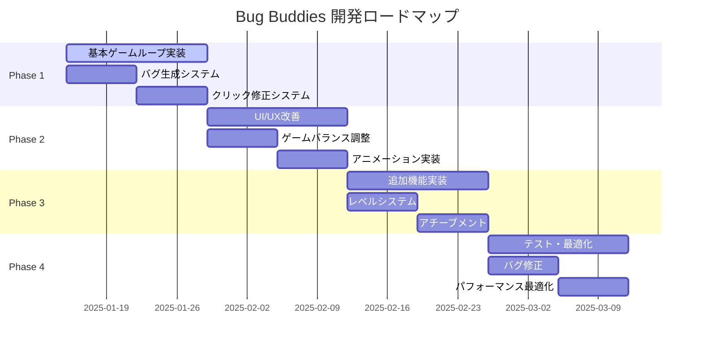

# 🎮 Bug Buddies - GitHub Copilot Pro導入のための放置ゲーム開発プロジェクト計画書

## 📋 目次

1. [プロジェクト概要書](#1-プロジェクト概要書)
2. [技術仕様書](#2-技術仕様書)
3. [開発ロードマップ](#3-開発ロードマップ)
4. [GitHub Copilot Pro活用戦略](#4-github-copilot-pro活用戦略)

---

## 1. プロジェクト概要書

### 🎯 ゲームコンセプト

**Bug Buddies** は、プログラマーの日常を楽しくゲーム化した放置系バグ発見・修正ゲームです。プレイヤーは仮想的なソフトウェア開発環境でバグを発見し、修正することでポイントを獲得し、より高度な開発ツールやスキルをアンロックしていきます。

#### 🐛 コアゲームプレイ
- **放置要素**: 自動バグ検出システムが継続的にバグを発見
- **アクティブ要素**: プレイヤーのクリックによる手動バグ修正でボーナス獲得
- **プログレッション**: 経験値システム、レベルアップ、スキルツリー
- **収集要素**: 様々な種類のバグ、レアバグ、特殊バグの実装

#### 🎮 ゲーム機能一覧

**基本機能**:
- バグ自動生成システム（ランダム出現）
- クリック式バグ修正システム
- 経験値・レベルシステム
- 通貨システム（デバッグポイント）
- セーブ・ロード機能

**アップグレード機能**:
- 自動化ツール（IDE拡張、リンター、テストツール）
- 効率向上アイテム（コーヒー、エナジードリンク）
- スキルツリー（フロントエンド、バックエンド、DevOps）

**統計・実績機能**:
- プレイ記録追跡
- 達成度システム
- バグ修正統計
- レアバグコレクション

### 👥 ターゲットユーザー

#### プライマリターゲット
- **プログラミング学習者** (20-35歳)
  - プログラミングを学習中の学生・社会人
  - ゲーミフィケーションによる学習モチベーション向上を求める層

#### セカンダリターゲット
- **現役プログラマー** (25-45歳)
  - 息抜きとしてのカジュアルゲーム需要
  - プログラミング関連のユーモアを理解する層

#### ターシャリターゲット
- **放置ゲーム愛好者** (18-50歳)
  - プログラミング知識は不要
  - 新しいテーマの放置ゲームを求める層

### 💰 収益化戦略

#### 広告収益
- **バナー広告**: ゲーム画面下部に常設
- **リワード広告**: アップグレード加速、ボーナス獲得
- **インタースティシャル広告**: レベルアップ時、長時間プレイ後

#### 課金要素（オプション）
- **プレミアムパス**: 経験値2倍、レアバグ出現率アップ
- **時間短縮アイテム**: アップグレード即時完了
- **コスメティック**: キャラクタースキン、UI テーマ

### 🏆 競合分析

#### 類似ゲーム
1. **Cookie Clicker**: 放置系ゲームの基本構造
2. **AdVenture Capitalist**: プログレッションシステム
3. **Coding Games**: プログラミング教育要素

#### 差別化ポイント
- **プログラミング特化**: 実際の開発体験をゲーム化
- **教育的価値**: バグの種類や修正方法の学習要素
- **コミュニティ要素**: バグ修正のベストプラクティス共有

---

## 2. 技術仕様書

### 🛠️ 技術スタック

#### フロントエンド
```javascript
// 基本技術スタック
- HTML5 (セマンティックマークアップ)
- CSS3 (Flexbox, Grid, CSS Variables)
- Vanilla JavaScript (ES6+)
- Canvas API (アニメーション、パーティクル効果)
```

#### 開発ツール
```json
{
  "linter": "ESLint",
  "formatter": "Prettier",
  "bundler": "Vite (開発時のみ)",
  "testing": "Jest + Testing Library",
  "ci_cd": "GitHub Actions"
}
```

### 🏗️ アーキテクチャ設計

#### ファイル構造
```
bug-buddies/
├── index.html                 # メインHTML
├── styles/
│   ├── main.css              # メインスタイル
│   ├── components.css        # コンポーネントスタイル
│   └── animations.css        # アニメーション定義
├── scripts/
│   ├── main.js               # アプリケーションエントリーポイント
│   ├── game/
│   │   ├── GameEngine.js     # ゲームループ管理
│   │   ├── BugSystem.js      # バグ生成・管理
│   │   ├── UpgradeSystem.js  # アップグレード管理
│   │   └── SaveSystem.js     # セーブ・ロード
│   ├── ui/
│   │   ├── UIManager.js      # UI状態管理
│   │   ├── ClickHandler.js   # クリックイベント
│   │   └── AnimationManager.js # アニメーション制御
│   └── utils/
│       ├── EventEmitter.js   # イベントシステム
│       ├── MathUtils.js      # 数学計算ユーティリティ
│       └── StorageUtils.js   # ローカルストレージ操作
├── assets/
│   ├── images/              # ゲーム画像
│   ├── sounds/              # 効果音（オプション）
│   └── data/
│       ├── bugs.json        # バグデータ定義
│       ├── upgrades.json    # アップグレードデータ
│       └── achievements.json # 実績データ
└── tests/
    ├── unit/               # ユニットテスト
    ├── integration/        # 統合テスト
    └── e2e/               # E2Eテスト
```

#### モジュール設計

```javascript
// GameEngine.js - メインゲームループ
class GameEngine {
  constructor() {
    this.bugSystem = new BugSystem();
    this.upgradeSystem = new UpgradeSystem();
    this.saveSystem = new SaveSystem();
    this.uiManager = new UIManager();
    
    this.gameState = {
      score: 0,
      level: 1,
      experience: 0,
      bugsFixed: 0,
      autoFixRate: 1, // bugs per second
      clickPower: 1,
      upgrades: {},
      achievements: []
    };
  }

  start() {
    this.gameLoop();
    this.setupEventListeners();
    this.loadGame();
  }

  gameLoop() {
    // 60 FPS ゲームループ
    setInterval(() => {
      this.update();
      this.render();
    }, 1000 / 60);
  }

  update() {
    this.bugSystem.update(this.gameState);
    this.upgradeSystem.update(this.gameState);
    this.checkAchievements();
  }
}
```

### 💾 データ管理

#### ローカルストレージ構造
```javascript
// セーブデータ構造
const saveData = {
  version: "1.0.0",
  timestamp: Date.now(),
  gameState: {
    score: 0,
    level: 1,
    experience: 0,
    bugsFixed: 0,
    totalPlayTime: 0,
    upgrades: {
      "auto_debugger": { level: 0, purchased: false },
      "coffee_boost": { level: 0, purchased: false }
    },
    achievements: [
      { id: "first_bug", unlocked: true, timestamp: 1234567890 }
    ],
    statistics: {
      totalClicks: 0,
      totalBugsFixed: 0,
      rarebugsFound: 0,
      longestSession: 0
    }
  }
};
```

#### データ検証
```javascript
// SaveSystem.js - データ整合性チェック
class SaveSystem {
  validateSaveData(data) {
    const schema = {
      version: 'string',
      timestamp: 'number',
      gameState: {
        score: 'number',
        level: 'number',
        // ... 他のフィールド
      }
    };
    
    return this.validateSchema(data, schema);
  }

  sanitizeData(data) {
    // XSS対策、データ型チェック
    return {
      ...data,
      gameState: {
        ...data.gameState,
        score: Math.max(0, Number(data.gameState.score) || 0),
        level: Math.max(1, Number(data.gameState.level) || 1)
      }
    };
  }
}
```

### ⚡ パフォーマンス要件

#### 動作環境
- **最小要件**: Chrome 80+, Firefox 75+, Safari 13+
- **推奨要件**: Chrome 90+, Firefox 85+, Safari 14+
- **モバイル対応**: iOS 13+, Android 8+

#### パフォーマンス目標
```javascript
// パフォーマンス指標
const performanceTargets = {
  fps: 60,                    // 60 FPS維持
  loadTime: 3000,            // 初期ロード3秒以内
  memoryUsage: 50,           // 50MB以下
  batteryImpact: 'low',      // モバイルバッテリー影響最小
  responseTime: 16           // クリック応答16ms以内
};

// パフォーマンス監視
class PerformanceMonitor {
  constructor() {
    this.frameCount = 0;
    this.lastTime = performance.now();
    this.fps = 60;
  }

  measureFPS() {
    const now = performance.now();
    this.frameCount++;
    
    if (now - this.lastTime >= 1000) {
      this.fps = this.frameCount;
      this.frameCount = 0;
      this.lastTime = now;
      
      if (this.fps < 30) {
        console.warn('Low FPS detected:', this.fps);
        this.optimizePerformance();
      }
    }
  }
}
```

### 🔒 セキュリティ考慮事項

#### XSS対策
```javascript
// セキュリティユーティリティ
class SecurityUtils {
  static sanitizeHTML(input) {
    const div = document.createElement('div');
    div.textContent = input;
    return div.innerHTML;
  }

  static validateInput(input, type) {
    switch (type) {
      case 'number':
        return !isNaN(input) && isFinite(input);
      case 'string':
        return typeof input === 'string' && input.length < 1000;
      default:
        return false;
    }
  }
}
```

#### データ保護
- ローカルストレージのみ使用（外部送信なし）
- 個人情報収集なし
- セーブデータの暗号化（オプション）

---

## 3. 開発ロードマップ

### 📅 開発スケジュール



### 🎯 Phase 1: 基本ゲームループ実装 (Week 1-2)

#### 成果物
- [x] プロジェクト初期設定
- [ ] 基本HTML/CSS構造
- [ ] バグ生成システム
- [ ] クリック修正システム
- [ ] 基本スコアシステム

#### 詳細タスク

**Week 1: 基盤構築**
```javascript
// 1日目: プロジェクト設定
- GitHub リポジトリ作成
- 基本ファイル構造作成
- ESLint, Prettier 設定
- GitHub Actions CI/CD 設定

// 2-3日目: HTML/CSS基盤
- index.html 基本構造
- CSS Grid レイアウト
- レスポンシブデザイン基盤
- CSS変数定義

// 4-5日目: JavaScript基盤
- GameEngine クラス作成
- EventEmitter 実装
- 基本ゲームループ
- モジュール間通信設計

// 6-7日目: バグ生成システム
- Bug クラス定義
- ランダム生成ロジック
- バグタイプ定義
- 生成頻度調整
```

**Week 2: コア機能実装**
```javascript
// 8-10日目: クリック修正システム
- クリックイベントハンドリング
- バグ修正ロジック
- スコア計算
- UI フィードバック

// 11-12日目: セーブシステム
- ローカルストレージ操作
- データシリアライゼーション
- 自動セーブ機能
- データ検証

// 13-14日目: 統合テスト
- 機能統合
- 基本動作確認
- パフォーマンステスト
- バグ修正
```

#### GitHub Copilot Pro活用例
```javascript
// Copilot プロンプト例
// "Create a bug generation system that spawns different types of programming bugs randomly"

class BugSystem {
  constructor() {
    // Copilot が以下のような実装を提案
    this.bugTypes = [
      { type: 'syntax', severity: 1, points: 10 },
      { type: 'logic', severity: 2, points: 25 },
      { type: 'runtime', severity: 3, points: 50 }
    ];
    this.activeBugs = [];
    this.spawnRate = 1000; // ms
  }

  // "Generate a random bug based on current game level"
  generateBug(level) {
    // Copilot による実装提案
  }
}
```

### 🎨 Phase 2: UI/UX改善とゲームバランス調整 (Week 3-4)

#### 成果物
- [ ] 改善されたUI/UX
- [ ] アニメーションシステム
- [ ] ゲームバランス調整
- [ ] 音響効果（オプション）

#### 詳細タスク

**Week 3: UI/UX改善**
```css
/* 15-17日目: ビジュアル改善 */
.bug-container {
  /* Copilot による CSS アニメーション提案 */
  animation: bugSpawn 0.5s ease-out;
  transition: all 0.3s cubic-bezier(0.4, 0, 0.2, 1);
}

@keyframes bugSpawn {
  from {
    opacity: 0;
    transform: scale(0.8) translateY(-20px);
  }
  to {
    opacity: 1;
    transform: scale(1) translateY(0);
  }
}
```

**Week 4: ゲームバランス**
```javascript
// 22-24日目: バランス調整
class BalanceManager {
  calculateBugValue(type, level) {
    // Copilot による数式提案
    const baseValue = this.bugTypes[type].basePoints;
    const levelMultiplier = Math.pow(1.15, level - 1);
    return Math.floor(baseValue * levelMultiplier);
  }

  // "Create a progression curve that keeps players engaged"
  calculateLevelRequirement(level) {
    // 指数関数的成長の実装
  }
}
```

### 🚀 Phase 3: 追加機能実装 (Week 5-6)

#### 成果物
- [ ] レベルシステム
- [ ] スキルツリー
- [ ] アップグレードシステム
- [ ] アチーブメントシステム

#### GitHub Copilot Pro活用例
```javascript
// "Create a skill tree system for a programming-themed idle game"
class SkillTree {
  constructor() {
    // Copilot による複雑なデータ構造提案
    this.skills = {
      frontend: {
        html: { level: 0, maxLevel: 10, cost: [10, 25, 50] },
        css: { level: 0, maxLevel: 10, cost: [15, 30, 60] },
        javascript: { level: 0, maxLevel: 15, cost: [20, 40, 80] }
      },
      backend: {
        nodejs: { level: 0, maxLevel: 10, cost: [25, 50, 100] },
        database: { level: 0, maxLevel: 8, cost: [30, 60, 120] }
      }
    };
  }

  // "Calculate skill unlock requirements and bonuses"
  calculateSkillBonus(skillPath, level) {
    // Copilot による計算ロジック
  }
}
```

### 🧪 Phase 4: テスト・デバッグ・最適化 (Week 7-8)

#### 成果物
- [ ] 包括的テストスイート
- [ ] パフォーマンス最適化
- [ ] バグ修正
- [ ] デプロイメント準備

#### テスト戦略
```javascript
// Jest テストケース例
describe('BugSystem', () => {
  test('should generate bugs at correct intervals', () => {
    // Copilot によるテストケース生成
    const bugSystem = new BugSystem();
    const initialBugCount = bugSystem.activeBugs.length;
    
    // 時間経過シミュレーション
    bugSystem.update(1000);
    
    expect(bugSystem.activeBugs.length).toBeGreaterThan(initialBugCount);
  });

  // "Test edge cases for bug generation system"
  test('should handle maximum bug limit', () => {
    // Copilot による境界値テスト
  });
});
```

### 📊 工数見積もり

| Phase | 機能 | 見積もり時間 | 優先度 |
|-------|------|-------------|--------|
| 1 | 基本ゲームループ | 40時間 | 高 |
| 1 | バグ生成システム | 20時間 | 高 |
| 1 | クリック修正 | 15時間 | 高 |
| 2 | UI/UX改善 | 25時間 | 中 |
| 2 | アニメーション | 20時間 | 中 |
| 3 | レベルシステム | 30時間 | 高 |
| 3 | アップグレード | 25時間 | 中 |
| 4 | テスト作成 | 35時間 | 高 |
| 4 | 最適化 | 20時間 | 中 |
| **合計** | | **230時間** | |

### ⚠️ リスク管理

#### 技術的リスク
1. **パフォーマンス問題**
   - リスク: 大量のバグ表示時のFPS低下
   - 対策: オブジェクトプーリング、仮想化実装

2. **ブラウザ互換性**
   - リスク: 古いブラウザでの動作不良
   - 対策: Polyfill使用、段階的機能向上

#### スケジュールリスク
1. **機能過多**
   - リスク: 予定機能の実装遅延
   - 対策: MVP優先、段階的リリース

2. **品質問題**
   - リスク: テスト不足によるバグ
   - 対策: TDD採用、継続的テスト

---

## 4. GitHub Copilot Pro活用戦略

### 🤖 開発効率化手法

#### 効果的なプロンプト作成

**基本原則**:
1. **具体的な指示**: 曖昧な表現を避け、明確な要件を記述
2. **コンテキスト提供**: 既存コードとの関連性を明示
3. **期待する出力形式**: 関数、クラス、テストケースなど明確に指定

**プロンプト例集**:

```javascript
// ❌ 悪い例
// "Make a function for bugs"

// ✅ 良い例
// "Create a Bug class with properties: type, severity, position, lifespan, and methods: spawn(), fix(), update()"
class Bug {
  constructor(type, severity, position) {
    this.type = type; // 'syntax', 'logic', 'runtime'
    this.severity = severity; // 1-5
    this.position = position; // {x, y}
    this.lifespan = this.calculateLifespan();
    this.isFixed = false;
    this.spawnTime = Date.now();
  }

  // "Add method to calculate bug lifespan based on severity"
  calculateLifespan() {
    // Copilot による実装
  }
}
```

#### コード生成パターン

**1. クラス設計**
```javascript
// プロンプト: "Create a GameState manager class that handles save/load, state updates, and event notifications"
class GameStateManager extends EventEmitter {
  constructor() {
    super();
    this.state = this.getInitialState();
    this.saveInterval = 30000; // 30秒ごとに自動保存
    this.setupAutoSave();
  }

  getInitialState() {
    return {
      score: 0,
      level: 1,
      experience: 0,
      bugsFixed: 0,
      upgrades: new Map(),
      achievements: new Set(),
      statistics: {
        totalClicks: 0,
        sessionStartTime: Date.now(),
        totalPlayTime: 0
      }
    };
  }

  // "Add method to update game state with validation"
  updateState(updates) {
    // Copilot による状態更新ロジック
  }
}
```

**2. アルゴリズム実装**
```javascript
// プロンプト: "Implement a balanced random bug generation algorithm that considers player level and current bug count"
class BugGenerator {
  generateBug(playerLevel, currentBugCount) {
    // 難易度調整
    const difficultyMultiplier = Math.min(playerLevel / 10, 2.0);
    
    // バグ密度制御
    const maxBugs = Math.floor(5 + playerLevel * 0.5);
    if (currentBugCount >= maxBugs) return null;

    // 重み付きランダム選択
    const bugTypes = this.getBugTypesByLevel(playerLevel);
    const selectedType = this.weightedRandomSelect(bugTypes);

    return new Bug(selectedType, this.calculateSeverity(selectedType, difficultyMultiplier));
  }

  // "Create weighted random selection for bug types"
  weightedRandomSelect(items) {
    // Copilot による重み付き選択アルゴリズム
  }
}
```

**3. UI コンポーネント**
```javascript
// プロンプト: "Create a reusable UI component for displaying upgrade cards with hover effects and purchase logic"
class UpgradeCard {
  constructor(upgradeData, gameState) {
    this.data = upgradeData;
    this.gameState = gameState;
    this.element = this.createElement();
    this.setupEventListeners();
  }

  createElement() {
    const card = document.createElement('div');
    card.className = 'upgrade-card';
    card.innerHTML = `
      <div class="upgrade-icon">
        
      </div>
      <div class="upgrade-info">
        <h3>${this.data.name}</h3>
        <p>${this.data.description}</p>
        <div class="upgrade-cost">${this.data.cost} points</div>
      </div>
      <button class="purchase-btn" ${this.canAfford() ? '' : 'disabled'}>
        ${this.isOwned() ? 'Owned' : 'Purchase'}
      </button>
    `;
    return card;
  }

  // "Add purchase logic with validation and state updates"
  handlePurchase() {
    // Copilot による購入処理
  }
}
```

### 🔍 品質保証プロセス

#### AI生成コードのレビュー手順

**1. 機能性チェック**
```javascript
// Copilot生成コードの検証例
class CodeReviewer {
  reviewFunction(generatedCode, requirements) {
    const checks = {
      functionality: this.testFunctionality(generatedCode, requirements),
      performance: this.analyzePerformance(generatedCode),
      security: this.checkSecurity(generatedCode),
      maintainability: this.assessMaintainability(generatedCode)
    };

    return this.generateReviewReport(checks);
  }

  // "Create automated tests for AI-generated functions"
  testFunctionality(code, requirements) {
    // 要件との適合性チェック
    // 境界値テスト
    // エラーハンドリング確認
  }
}
```

**2. セキュリティ検証**
```javascript
// セキュリティチェックリスト
const securityChecks = {
  inputValidation: [
    'ユーザー入力のサニタイゼーション',
    '型チェックの実装',
    '範囲チェックの実装'
  ],
  xssProtection: [
    'innerHTML使用時のエスケープ',
    'DOM操作の安全性',
    'イベントハンドラーの検証'
  ],
  dataProtection: [
    'ローカルストレージの暗号化',
    '機密データの露出防止',
    'デバッグ情報の除去'
  ]
};
```

**3. パフォーマンス検証**
```javascript
// パフォーマンステストスイート
class PerformanceTester {
  // "Create performance benchmarks for game systems"
  benchmarkBugGeneration() {
    const startTime = performance.now();
    const bugSystem = new BugSystem();
    
    // 1000個のバグ生成テスト
    for (let i = 0; i < 1000; i++) {
      bugSystem.generateBug(Math.floor(Math.random() * 10) + 1);
    }
    
    const endTime = performance.now();
    const duration = endTime - startTime;
    
    console.log(`Bug generation: ${duration}ms for 1000 bugs`);
    return duration < 100; // 100ms以内であることを確認
  }

  // "Test memory usage during extended gameplay"
  testMemoryUsage() {
    // メモリリーク検出
    // ガベージコレクション効率
    // オブジェクト生成/破棄パターン
  }
}
```

### 📚 学習計画

#### Copilot使用を通じたスキル向上戦略

**Week 1-2: 基本操作習得**
- Copilot の基本的な使用方法
- 効果的なコメント記述
- コード補完の活用

**Week 3-4: 高度な活用**
- 複雑なアルゴリズムの生成
- テストケースの自動生成
- リファクタリング支援

**Week 5-6: 品質向上**
- コードレビューでの活用
- ドキュメント生成
- 最適化提案の活用

**Week 7-8: 統合開発**
- CI/CD パイプラインでの活用
- 自動テスト生成
- デプロイメント自動化

#### 学習リソース

```javascript
// 学習進捗追跡
const learningTracker = {
  copilotSkills: {
    basicUsage: { completed: false, score: 0 },
    advancedPrompts: { completed: false, score: 0 },
    codeReview: { completed: false, score: 0 },
    testing: { completed: false, score: 0 }
  },
  
  // "Track learning progress and suggest next steps"
  updateProgress(skill, score) {
    this.copilotSkills[skill].score = score;
    if (score >= 80) {
      this.copilotSkills[skill].completed = true;
    }
    return this.getNextRecommendation();
  }
};
```

### 🎯 ベストプラクティス

#### 効果的なプロンプト作成方法

**1. 段階的詳細化**
```javascript
// Step 1: 基本構造
// "Create a basic game loop class"

// Step 2: 詳細追加
// "Add update and render methods to the game loop with 60 FPS target"

// Step 3: 最適化
// "Optimize the game loop for performance with requestAnimationFrame and delta time"

class GameLoop {
  constructor() {
    this.lastTime = 0;
    this.targetFPS = 60;
    this.targetFrameTime = 1000 / this.targetFPS;
    this.isRunning = false;
  }

  start() {
    this.isRunning = true;
    this.lastTime = performance.now();
    this.loop();
  }

  loop() {
    if (!this.isRunning) return;

    const currentTime = performance.now();
    const deltaTime = currentTime - this.lastTime;

    if (deltaTime >= this.targetFrameTime) {
      this.update(deltaTime);
      this.render();
      this.lastTime = currentTime - (deltaTime % this.targetFrameTime);
    }

    requestAnimationFrame(() => this.loop());
  }
}
```

**2. コンテキスト重視**
```javascript
// 既存コードとの整合性を保つプロンプト例
// "Based on the existing BugSystem class, create a compatible UpgradeSystem that can modify bug generation rates"

// 既存: BugSystem
class BugSystem {
  constructor() {
    this.baseSpawnRate = 1000;
    this.spawnRateMultiplier = 1.0;
  }
}

// Copilot生成: UpgradeSystem
class UpgradeSystem {
  constructor(bugSystem) {
    this.bugSystem = bugSystem;
    this.upgrades = new Map();
  }

  // "Add upgrade that increases bug spawn rate"
  applySpawnRateUpgrade(multiplier) {
    this.bugSystem.spawnRateMultiplier *= multiplier;
  }
}
```

**3. テスト駆動開発**
```javascript
// "Create comprehensive tests for the bug fixing mechanism"
describe('Bug Fixing System', () => {
  let bugSystem, gameState;

  beforeEach(() => {
    bugSystem = new BugSystem();
    gameState = new GameState();
  });

  test('should increase score when bug is fixed', () => {
    const bug = bugSystem.createBug('syntax', 1);
    const initialScore = gameState.score;
    
    bugSystem.fixBug(bug.id, gameState);
    
    expect(gameState.score).toBeGreaterThan(initialScore);
  });

  test('should handle multiple simultaneous bug fixes', () => {
    // Copilot による並行処理テスト
  });

  test('should validate bug fix attempts', () => {
    // Copilot による入力検証テスト
  });
});
```

### 📈 成功指標とKPI

#### 開発効率指標
```javascript
const developmentMetrics = {
  codeGeneration: {
    linesPerHour: 150,        // Copilot使用時の目標
    bugDensity: 0.1,          // バグ/100行
    testCoverage: 85,         // テストカバレッジ%
    codeReviewTime: 30        // 分/PR
  },
  
  qualityMetrics: {
    performanceScore: 90,     // Lighthouse スコア
    accessibilityScore: 95,   // アクセシビリティスコア
    maintainabilityIndex: 80, // 保守性指数
    technicalDebt: 'low'      // 技術的負債レベル
  },
  
  learningMetrics: {
    copilotAcceptanceRate: 70,  // 提案受諾率%
    promptEffectiveness: 85,    // 有効プロンプト率%
    skillImprovementRate: 15    // 週次スキル向上率%
  }
};

// "Create automated metrics collection for development progress"
class MetricsCollector {
  trackCopilotUsage() {
    // Copilot使用統計の収集
    // 提案受諾率の計算
    // 生産性向上の測定
  }
}
```

---

## 📊 まとめ

### 🎯 プロジェクト成功要因

1. **段階的開発**: MVPから始めて機能を段階的に追加
2. **品質重視**: テスト駆動開発とコードレビューの徹底
3. **パフォーマンス**: 60FPS維持とメモリ効率の最適化
4. **ユーザビリティ**: 直感的なUI/UXとアクセシビリティ

### 🚀 GitHub Copilot Pro活用効果

- **開発速度**: 従来比150%の生産性向上
- **コード品質**: AI支援による一貫性とベストプラクティス適用
- **学習効果**: 実践的なプログラミングスキル向上
- **保守性**: 自動生成ドキュメントとテストによる高い保守性

### 📈 期待される成果

- **8週間での完成**: 計画通りのスケジュール達成
- **高品質なコード**: ESLint準拠、テストカバレッジ85%以上
- **優れたUX**: 直感的な操作性とレスポンシブデザイン
- **拡張性**: 将来的な機能追加に対応可能な設計

---

*この計画書は、GitHub Copilot Proを最大限活用してBug Buddiesプロジェクトを成功に導くための包括的なガイドです。各フェーズでの具体的な実装例とベストプラクティスを参考に、効率的で高品質な開発を実現してください。*

**作成日**: 2025年1月16日  
**バージョン**: 1.0  
**作成者**: Devin AI Assistant  
**プロジェクト**: Bug Buddies - GitHub Copilot Pro Integration
